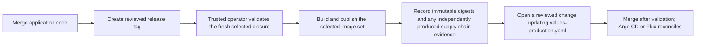

# GitOps deployment

This repository supports both Argo CD and Flux. Each controller reconciles the
same application-owned Helm chart and production values:

- chart: `.helm/`
- release values: `.helm/values-production.yaml`
- Argo CD entrypoint: `deploy/argocd/`
- Flux entrypoint: `deploy/flux/`

Run `pnpm nrb init --name ... --domain ... --owner ...` before configuring a
cluster. Initialization replaces the template repository owner, product slug,
namespace, registry path, and all public domains in these files. A manifest that
still contains `your-github-org`, `example.com`, or
`sha-REPLACE_WITH_RELEASE_GIT_SHA` is intentionally not deployable.

## Ownership boundary

The application repository owns image references, Helm templates, application
configuration, migration hooks, Services, probes, ingress routes, and Secret
references. A platform/config repository should own cluster creation, controller
installation, controller RBAC/projects, secret backends, ingress controllers,
DNS/TLS issuers, databases, observability infrastructure, and disaster recovery.

For a simple single-cluster setup, the manifests in this repository can be
applied directly. Larger installations should copy or reference them from the
platform repository and pin the application source to a reviewed branch, tag, or
commit according to the promotion policy.

## Release and promotion flow



The repository does not contain an automated publisher or promotion actor. A
trusted operator must accept only a full 40-character source SHA, validate its
setup-selected closure, intersect `releaseImages` with effective Helm ownership,
and provide every required immutable digest to the tag updater. Unselected or
disabled image values stay unchanged. Run `pnpm run deploy:validate:gitops` on
the resulting topic branch and merge it only through normal review.

The release planner still derives application images from the setup catalog and
the selected closure; missing or stale closure metadata fails validation.
SBOMs, scans, signatures, and attestations are required only when the selected
external release policy calls for them and must be verified independently. They
are not produced by this repository.

## Common prerequisites

- a Kubernetes cluster compatible with the selected Helm version;
- release images published under full-SHA tags by a trusted builder and recorded
  by immutable digest;
- a target namespace Secret named by `secrets.existingSecret` containing at
  least `SESSION_SECRET`, `BETTER_AUTH_SECRET`, and the selected provider
  credential: `DATABASE_URL` for PostgreSQL or a replica-set `MONGODB_URI` for
  MongoDB;
- `ghcr-credentials` in the target namespace when images are private;
- reachable Redis and either PostgreSQL or a transaction-capable, multi-node
  MongoDB replica set;
- ingress, DNS, and TLS configured for every enabled application domain.

The current manifests use the stable APIs documented by each controller:
`argoproj.io/v1alpha1` Application, `source.toolkit.fluxcd.io/v1`
GitRepository, and `helm.toolkit.fluxcd.io/v2` HelmRelease.

## Validate before applying

```bash
pnpm run deploy:validate:gitops
kubectl kustomize deploy/argocd >/dev/null
kubectl kustomize deploy/flux >/dev/null
```

`deploy:validate:gitops` performs strict Helm lint/render validation, checks the
Argo CD and Flux contracts, and renders both Kustomize entrypoints. It does not
contact or mutate a cluster.

## Argo CD

Install and configure Argo CD through the platform layer, then apply the
application:

```bash
kubectl apply -k deploy/argocd
argocd app get nest-react-boilerplate
argocd app wait nest-react-boilerplate --health --timeout 600
```

The Application tracks `main`, enables prune and self-heal, creates the target
namespace, and retries transient sync failures. For a private Git repository,
configure repository credentials in Argo CD; do not add credentials to this
manifest.

No repository-owned Argo sync shortcut is installed. Run the reviewed Argo CD
CLI commands from the platform operations environment with its scoped
credentials.

## Flux

Install Flux through the platform layer, then apply the source and release:

```bash
kubectl apply -k deploy/flux
flux get sources git -n flux-system
flux get helmreleases -n flux-system
flux reconcile helmrelease nest-react-boilerplate -n flux-system --with-source
```

The GitRepository tracks `main`. The HelmRelease reads `.helm/`, merges
`values.yaml` with `values-production.yaml`, creates the application namespace,
waits up to ten minutes, retries failed installs/upgrades, and rolls back failed
upgrades. For a private repository, add a same-namespace `secretRef` through the
platform overlay instead of committing credentials.

## Secrets and image pulls

The chart consumes an existing Secret through `secrets.existingSecret`; it does
not own production secret values. Provision that Secret with External Secrets,
Vault, SOPS, Sealed Secrets, or the platform's equivalent. The Secret must exist
before the migration hook and application pods run.

Production values reference `ghcr-credentials`. Create it through the platform
secret flow, or remove the pull-secret reference when every image is public.

## Verification and rollback

After reconciliation:

```bash
kubectl get pods,job,svc,ingress -n nest-react-boilerplate
kubectl rollout status deployment/nest-react-boilerplate-auth-app-api -n nest-react-boilerplate
curl -fsS https://auth-app-api.example.com/ready
```

Rollback is Git-driven: revert the promotion pull request or promote a previous
verified image SHA, merge the change, and let the controller reconcile. Database
schema changes must remain backward-compatible across the rollback window. When
they are not, restore a verified backup with the selected PostgreSQL or MongoDB
workflow, or roll forward with a corrective migration before returning
application traffic.

Do not use the controller's imperative rollback as the lasting state; record the
same rollback in Git so reconciliation does not reapply the failed version.
